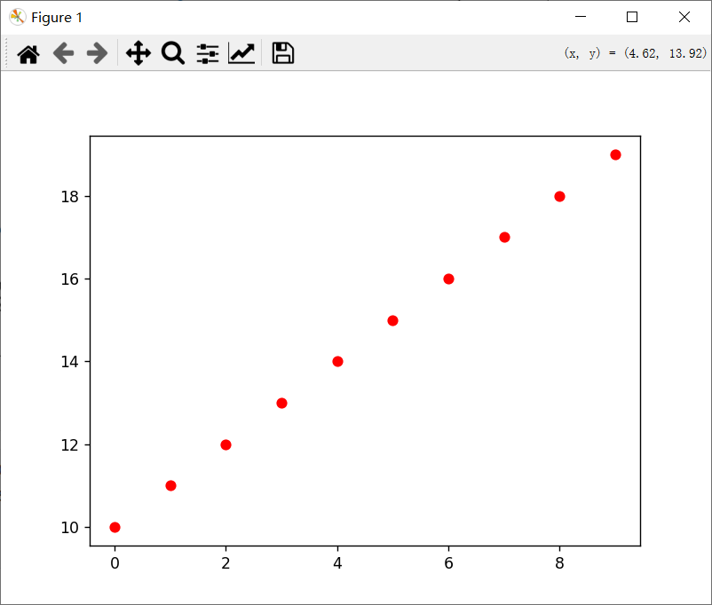

Hongji Wang

hw88@rice.edu

# Task 1

```shell
(my_tf) C:\Users\dell>conda info

     active environment : my_tf
    active env location : D:\anaconda3\envs\my_tf
            shell level : 2
       user config file : C:\Users\dell\.condarc
 populated config files : C:\Users\dell\.condarc
          conda version : 24.7.1
    conda-build version : 24.5.1
         python version : 3.12.4.final.0
                 solver : libmamba (default)
       virtual packages : __archspec=1=icelake
                          __conda=24.7.1=0
                          __cuda=11.8=0
                          __win=0=0
       base environment : D:\anaconda3  (writable)
      conda av data dir : D:\anaconda3\etc\conda
  conda av metadata url : None
           channel URLs : https://repo.anaconda.com/pkgs/main/win-64
                          https://repo.anaconda.com/pkgs/main/noarch
                          https://repo.anaconda.com/pkgs/r/win-64
                          https://repo.anaconda.com/pkgs/r/noarch
                          https://repo.anaconda.com/pkgs/msys2/win-64
                          https://repo.anaconda.com/pkgs/msys2/noarch
          package cache : D:\anaconda3\pkgs
                          C:\Users\dell\.conda\pkgs
                          C:\Users\dell\AppData\Local\conda\conda\pkgs
       envs directories : D:\anaconda3\envs
                          C:\Users\dell\.conda\envs
                          C:\Users\dell\AppData\Local\conda\conda\envs
               platform : win-64
             user-agent : conda/24.7.1 requests/2.32.2 CPython/3.12.4 Windows/10 Windows/10.0.19045 solver/libmamba conda-libmamba-solver/24.1.0 libmambapy/1.5.8 aau/0.4.4 c/. s/. e/.
          administrator : False
             netrc file : None
           offline mode : False
```

# Task 2

```python
In [1]: import numpy as np

In [2]: import scipy.linalg

In [3]: a = [[1, 2, 3, 4], [5, 6, 7, 8], [9, 10, 11, 12]]
```

```shell
In [4]: np.ndim(a)
Out[4]: 2

In [5]: np.size(a)
Out[5]: 12

In [6]: np.shape(a)
Out[6]: (3, 4)

In [7]: a.shape[0]
---------------------------------------------------------------------------
AttributeError                            Traceback (most recent call last)
Cell In[7], line 1
----> 1 a.shape[0]

AttributeError: 'list' object has no attribute 'shape'

In [8]: a = np.array(a)

In [9]: a.shape[0]
Out[9]: 3

In [10]: b = np.array([1, 1, 1, 1])
```

In the input `In [7]`, a is still a 'list', not a 'np.array'.

```python
In [16]: b = np.array([[1, 1, 1]])

In [17]: c = np.block([[a, b.T]])

In [18]: c
Out[18]:
array([[ 1,  2,  3,  4,  1],
       [ 5,  6,  7,  8,  1],
       [ 9, 10, 11, 12,  1]])
```

`[[1, 1, 1]]` is different from `[1, 1, 1]`

```python
In [19]: a[-1]
Out[19]: array([ 9, 10, 11, 12])

In [20]: a[1, 2]
Out[20]: 7

In [21]: a[1, :]
Out[21]: array([5, 6, 7, 8])

In [22]: a[-2:]
Out[22]:
array([[ 5,  6,  7,  8],
       [ 9, 10, 11, 12]])

In [23]: a[0:2, 1:3]
Out[23]:
array([[2, 3],
       [6, 7]])

In [24]: a[np.ix_([0, 2], [0, 2, 3])]
Out[24]:
array([[ 1,  3,  4],
       [ 9, 11, 12]])
```

`np.ix_` is a function in NumPy used to construct an open mesh from multiple sequences (like lists or 1D arrays) to facilitate broadcasting. It is particularly useful when you want to index a multi-dimensional array using multiple 1D arrays. (copy from ChatGPT)

```python
In [25]: a[0:3:2, :]
Out[25]:
array([[ 1,  2,  3,  4],
       [ 9, 10, 11, 12]])

In [26]: a[::2, :]
Out[26]:
array([[ 1,  2,  3,  4],
       [ 9, 10, 11, 12]])

In [27]: a[::-1, :]
Out[27]:
array([[ 9, 10, 11, 12],
       [ 5,  6,  7,  8],
       [ 1,  2,  3,  4]])

In [28]: a[np.r_[:len(a), 0]]
Out[28]:
array([[ 1,  2,  3,  4],
       [ 5,  6,  7,  8],
       [ 9, 10, 11, 12],
       [ 1,  2,  3,  4]])
```

`np.r_` is a convenient function in NumPy that allows you to create arrays by concatenating slices, lists, or arrays along the first axis (row-wise). It provides a flexible syntax for constructing arrays, often simplifying the code. (copy from ChatGPT)

`a[np.r_[len(a), 0]]` $\rightarrow$`a[[0, 1, 2, 3, 0]`$\rightarrow$`a` with copy of the first row appended to the end

```python
In [29]: a.transpose()
Out[29]:
array([[ 1,  5,  9],
       [ 2,  6, 10],
       [ 3,  7, 11],
       [ 4,  8, 12]])

In [30]: a.conj().T
Out[30]:
array([[ 1,  5,  9],
       [ 2,  6, 10],
       [ 3,  7, 11],
       [ 4,  8, 12]])
```

```python
In [31]: b = np.array([1, 2, 3, 4])

In [32]: a @ b
Out[32]: array([ 30,  70, 110])

In [33]: a * b
Out[33]:
array([[ 1,  4,  9, 16],
       [ 5, 12, 21, 32],
       [ 9, 20, 33, 48]])
```

```python
In [34]: a / b
Out[34]:
array([[1.        , 1.        , 1.        , 1.        ],
       [5.        , 3.        , 2.33333333, 2.        ],
       [9.        , 5.        , 3.66666667, 3.        ]])

In [35]: a**3
Out[35]:
array([[   1,    8,   27,   64],
       [ 125,  216,  343,  512],
       [ 729, 1000, 1331, 1728]], dtype=int32)

In [36]: a > 0.5
Out[36]:
array([[ True,  True,  True,  True],
       [ True,  True,  True,  True],
       [ True,  True,  True,  True]])

In [37]: np.nonzero(a > 0.5)
Out[37]:
(array([0, 0, 0, 0, 1, 1, 1, 1, 2, 2, 2, 2], dtype=int64),
 array([0, 1, 2, 3, 0, 1, 2, 3, 0, 1, 2, 3], dtype=int64))
 
In [41]: v = np.array([0, 1, 0, 1])

In [42]: a[:, np.nonzero(v>0.5)[0]]
Out[42]:
array([[ 2,  4],
       [ 6,  8],
       [10, 12]])
      
In [43]: a[:, v.T>0.5]
Out[43]:
array([[ 2,  4],
       [ 6,  8],
       [10, 12]])

In [44]: a[a<6] = 0

In [45]: a
Out[45]:
array([[ 0,  0,  0,  0],
       [ 0,  6,  7,  8],
       [ 9, 10, 11, 12]])
       
In [46]: a * (a > 0.5)
Out[46]:
array([[ 0,  0,  0,  0],
       [ 0,  6,  7,  8],
       [ 9, 10, 11, 12]])
  
In [47]: a [:] = 3

In [48]: a
Out[48]:
array([[3, 3, 3, 3],
       [3, 3, 3, 3],
       [3, 3, 3, 3]])
```

```python
In [49]: x = np.array([[1, 2, 3, 4], [5, 6, 7, 8], [9, 10, 11, 12]])

In [50]: y = x.copy()

In [52]: y
Out[52]:
array([[ 1,  2,  3,  4],
       [ 5,  6,  7,  8],
       [ 9, 10, 11, 12]])

In [53]: y = x[1, :].copy()

In [54]: y = x.flatten()

In [55]: y
Out[55]: array([ 1,  2,  3,  4,  5,  6,  7,  8,  9, 10, 11, 12])
```
In Python (and particularly in NumPy), the expression `y = x.copy()` creates a deep copy of the array x and assigns it to y. This means that y will be a completely independent copy of x, and changes made to y will not affect x, and vice versa. (copy from ChatGPT)
```python
In [56]: np.arange(1., 11.)
Out[56]: array([ 1.,  2.,  3.,  4.,  5.,  6.,  7.,  8.,  9., 10.])

In [57]: np.arange(10.)
Out[57]: array([0., 1., 2., 3., 4., 5., 6., 7., 8., 9.])

In [59]: np.arange(1., 11.)[:, np.newaxis]
Out[59]:
array([[ 1.],
       [ 2.],
       [ 3.],
       [ 4.],
       [ 5.],
       [ 6.],
       [ 7.],
       [ 8.],
       [ 9.],
       [10.]])

In [60]: np.zeros((3, 4))
Out[60]:
array([[0., 0., 0., 0.],
       [0., 0., 0., 0.],
       [0., 0., 0., 0.]])

In [61]: np.zeros((3, 4, 5))
Out[61]:
array([[[0., 0., 0., 0., 0.],
        [0., 0., 0., 0., 0.],
        [0., 0., 0., 0., 0.],
        [0., 0., 0., 0., 0.]],

       [[0., 0., 0., 0., 0.],
        [0., 0., 0., 0., 0.],
        [0., 0., 0., 0., 0.],
        [0., 0., 0., 0., 0.]],

       [[0., 0., 0., 0., 0.],
        [0., 0., 0., 0., 0.],
        [0., 0., 0., 0., 0.],
        [0., 0., 0., 0., 0.]]])

In [62]: np.ones((3, 4))
Out[62]:
array([[1., 1., 1., 1.],
       [1., 1., 1., 1.],
       [1., 1., 1., 1.]])

In [63]: np.eye(3)
Out[63]:
array([[1., 0., 0.],
       [0., 1., 0.],
       [0., 0., 1.]])

In [65]: np.diag([1, 2, 3, 4], 0)
Out[65]:
array([[1, 0, 0, 0],
       [0, 2, 0, 0],
       [0, 0, 3, 0],
       [0, 0, 0, 4]])

In [68]: np.diag([1, 2, 3], 0)
Out[68]:
array([[1, 0, 0],
       [0, 2, 0],
       [0, 0, 3]])
```

```python
In [69]: from numpy.random import default_rng

In [70]: rgn = default_rng(42)

In [71]: rng.random((3,  4))

In [72]: rgn.random((3,  4))
Out[72]:
array([[0.77395605, 0.43887844, 0.85859792, 0.69736803],
       [0.09417735, 0.97562235, 0.7611397 , 0.78606431],
       [0.12811363, 0.45038594, 0.37079802, 0.92676499]])

In [73]: np.linspace(1, 3, 4)
Out[73]: array([1.        , 1.66666667, 2.33333333, 3.        ])

In [75]: np.mgrid[0:9., 0:6.]
Out[75]:
array([[[0., 0., 0., 0., 0., 0.],
        [1., 1., 1., 1., 1., 1.],
        [2., 2., 2., 2., 2., 2.],
        [3., 3., 3., 3., 3., 3.],
        [4., 4., 4., 4., 4., 4.],
        [5., 5., 5., 5., 5., 5.],
        [6., 6., 6., 6., 6., 6.],
        [7., 7., 7., 7., 7., 7.],
        [8., 8., 8., 8., 8., 8.]],

       [[0., 1., 2., 3., 4., 5.],
        [0., 1., 2., 3., 4., 5.],
        [0., 1., 2., 3., 4., 5.],
        [0., 1., 2., 3., 4., 5.],
        [0., 1., 2., 3., 4., 5.],
        [0., 1., 2., 3., 4., 5.],
        [0., 1., 2., 3., 4., 5.],
        [0., 1., 2., 3., 4., 5.],
        [0., 1., 2., 3., 4., 5.]]])

In [82]: np.ix_([1, 2, 4], [2, 4, 5])
Out[82]:
(array([[1],
        [2],
        [4]]),
 array([[2, 4, 5]]))
```

```python
In [83]: a
Out[83]:
array([[3, 3, 3, 3],
       [3, 3, 3, 3],
       [3, 3, 3, 3]])
      
In [86]: b = np.ones((3, 2))

In [87]: np.concatenate((a, b), 1)
Out[87]:
array([[3., 3., 3., 3., 1., 1.],
       [3., 3., 3., 3., 1., 1.],
       [3., 3., 3., 3., 1., 1.]])
       
In [88]: np.hstack((a, b))
Out[88]:
array([[3., 3., 3., 3., 1., 1.],
       [3., 3., 3., 3., 1., 1.],
       [3., 3., 3., 3., 1., 1.]])
       
In [91]: b = np.ones((2, 4))

In [92]: np.concatenate((a,b))
Out[92]:
array([[3., 3., 3., 3.],
       [3., 3., 3., 3.],
       [3., 3., 3., 3.],
       [1., 1., 1., 1.],
       [1., 1., 1., 1.]])
```

```python
In [94]: a
Out[94]:
array([[ 0,  1,  2,  3],
       [ 4,  5,  6,  7],
       [ 8,  9, 10, 11]])

In [95]: a.max()
Out[95]: 11

In [96]: a.max(0)
Out[96]: array([ 8,  9, 10, 11])

In [97]: a.max(1)
Out[97]: array([ 3,  7, 11])

In [101]: b
Out[101]:
array([[12, 13, 14, 15],
       [16, 17, 18, 19],
       [20, 21, 22, 23]])

In [102]: np.maximum(a, b)
Out[102]:
array([[12, 13, 14, 15],
       [16, 17, 18, 19],
       [20, 21, 22, 23]])

In [104]: np.linalg.norm(a)
Out[104]: 22.494443758403985

In [106]: np.logical_and(a, b)
Out[106]:
array([[False,  True,  True,  True],
       [ True,  True,  True,  True],
       [ True,  True,  True,  True]])

In [107]: np.logical_or(a, b)
Out[107]:
array([[ True,  True,  True,  True],
       [ True,  True,  True,  True],
       [ True,  True,  True,  True]])

In [108]: a & b
Out[108]:
array([[0, 1, 2, 3],
       [0, 1, 2, 3],
       [0, 1, 2, 3]])

In [109]: a | b
Out[109]:
array([[12, 13, 14, 15],
       [20, 21, 22, 23],
       [28, 29, 30, 31]])
```

```python
In [112]: s = np.arange(1, 17).reshape(4, 4)

In [113]: scipy.linalg.inv(s)
Out[113]:
array([[ 1.50119988e+15, -3.75299969e+14, -3.75299969e+15,
         2.62709978e+15],
       [-1.95155984e+16,  1.95155984e+16,  1.95155984e+16,
        -1.95155984e+16],
       [ 3.45275971e+16, -3.79052969e+16, -2.77721977e+16,
         3.11498974e+16],
       [-1.65131986e+16,  1.87649984e+16,  1.20095990e+16,
        -1.42613988e+16]])

In [114]: scipy.linalg.pinv(s)
Out[114]:
array([[-0.285 , -0.145 , -0.005 ,  0.135 ],
       [-0.1075, -0.0525,  0.0025,  0.0575],
       [ 0.07  ,  0.04  ,  0.01  , -0.02  ],
       [ 0.2475,  0.1325,  0.0175, -0.0975]])

In [120]: a = rgn.random((4, 4))

In [121]: a
Out[121]:
array([[0.15428949, 0.68304895, 0.74476216, 0.96750973],
       [0.32582536, 0.37045971, 0.46955581, 0.18947136],
       [0.12992151, 0.47570493, 0.22690935, 0.66981399],
       [0.43715192, 0.8326782 , 0.7002651 , 0.31236664]])

In [123]: scipy.linalg.solve(s, a)
<ipython-input-123-9bf0b68e3204>:1: LinAlgWarning: Ill-conditioned matrix (rcond=3.26536e-19): result may not be accurate.
  scipy.linalg.solve(s, a)
Out[123]:
array([[ 7.70183461e+14,  1.28856776e+15,  1.92988816e+15,
        -3.11876483e+14],
       [-2.64816029e+15, -1.30669132e+16, -1.46086373e+16,
        -8.20808543e+15],
       [ 2.98577020e+15,  2.22681231e+16,  2.34276101e+16,
         1.73518003e+16],
       [-1.10779337e+15, -1.04897777e+16, -1.07488610e+16,
        -8.83183840e+15]])

In [124]: scipy.linalg.solve(a.T, s.T)
Out[124]:
array([[ 3.38871594e+00,  4.23378270e-04, -3.38786919e+00,
        -6.77616175e+00],
       [ 5.89660755e+00,  2.26384272e+01,  3.93802468e+01,
         5.61220664e+01],
       [ 1.10234972e+00,  9.37330495e+00,  1.76442602e+01,
         2.59152154e+01],
       [-3.63106370e+00, -8.22147336e+00, -1.28118830e+01,
        -1.74022927e+01]])

In [125]: U, S, Vh = scipy.linalg.svd(s); V = Vh.T

In [126]: U
Out[126]:
array([[-0.13472212, -0.82574206,  0.54255324,  0.07507318],
       [-0.3407577 , -0.4288172 , -0.77936056,  0.30429774],
       [-0.54679327, -0.03189234, -0.06893859, -0.83381501],
       [-0.75282884,  0.36503251,  0.30574592,  0.45444409]])

In [127]: S
Out[127]: array([3.86226568e+01, 2.07132307e+00, 1.57283823e-15, 3.14535571e-16])

In [128]: V
Out[128]:
array([[-0.4284124 ,  0.71865348, -0.19891147,  0.51032757],
       [-0.47437252,  0.27380781, -0.11516042, -0.82869661],
       [-0.52033264, -0.17103786,  0.82705525,  0.12641052],
       [-0.56629275, -0.61588352, -0.51298336,  0.19195853]])

In [140]: a = [[1, 1, 1], [2, 2, 2], [3, 3, 3]]

In [141]: scipy.linalg.cholesky(a)
Out[141]:
array([[1., 1., 1.],
       [0., 1., 1.],
       [0., 0., 1.]])
```

```python
In [145]: s
Out[145]:
array([[1, 2, 3],
       [4, 5, 6],
       [7, 8, 9]])

In [146]: a
Out[146]: [[1, 1, 1], [2, 2, 2], [3, 3, 3]]

In [147]: D, V = scipy.linalg.eig(s, a)

In [148]: D
Out[148]: array([3.        +0.j,        inf+0.j, 1.75973497+0.j])

In [149]: V
Out[149]:
array([[-3.33333333e-01,  3.70074342e-17,  4.08248290e-01],
       [ 6.66666667e-01, -7.07106781e-01, -8.16496581e-01],
       [-6.66666667e-01,  7.07106781e-01,  4.08248290e-01]])

In [173]: scipy.linalg.qr(s)
Out[173]:
(array([[-0.12309149,  0.90453403,  0.40824829],
        [-0.49236596,  0.30151134, -0.81649658],
        [-0.86164044, -0.30151134,  0.40824829]]),
 array([[-8.12403840e+00, -9.60113630e+00, -1.10782342e+01],
        [ 0.00000000e+00,  9.04534034e-01,  1.80906807e+00],
        [ 0.00000000e+00,  0.00000000e+00, -1.11164740e-15]]))

In [174]: scipy.linalg.lu(a)
Out[174]:
(array([[0., 0., 1.],
        [0., 1., 0.],
        [1., 0., 0.]]),
 array([[1.        , 0.        , 0.        ],
        [0.66666667, 1.        , 0.        ],
        [0.33333333, 0.5       , 1.        ]]),
 array([[3.00000000e+00, 3.00000000e+00, 3.00000000e+00],
        [0.00000000e+00, 1.11022302e-16, 1.11022302e-16],
        [0.00000000e+00, 0.00000000e+00, 0.00000000e+00]]))
```

```python
In [176]: np.fft.fft(a)
Out[176]:
array([[3.+0.j, 0.+0.j, 0.+0.j],
       [6.+0.j, 0.+0.j, 0.+0.j],
       [9.+0.j, 0.+0.j, 0.+0.j]])

In [177]: np.fft.ifft(a)
Out[177]:
array([[1.+0.j, 0.+0.j, 0.+0.j],
       [2.+0.j, 0.+0.j, 0.+0.j],
       [3.+0.j, 0.+0.j, 0.+0.j]])
```

```python
In [197]: a = [[5, 2, 6], [3, 7, 1], [8, 9, 4]]

In [198]: a = np.array(a)

In [199]: np.sort(a)
Out[199]:
array([[2, 5, 6],
       [1, 3, 7],
       [4, 8, 9]])

In [200]: np.sort(a, axis=1)
Out[200]:
array([[2, 5, 6],
       [1, 3, 7],
       [4, 8, 9]])

In [202]: I = np.argsort(a[:, 0])

In [203]: a[I, :]
Out[203]:
array([[3, 7, 1],
       [5, 2, 6],
       [8, 9, 4]])
```

`np.argsort()` is a NumPy function that returns the **indices that would sort an array**. Instead of directly sorting the array, `np.argsort()` returns the indices that would sort the array if you applied them to the original array. (copy fron ChatGPT)

```python
In [204]: s
Out[204]:
array([[1, 2, 3],
       [4, 5, 6],
       [7, 8, 9]])

In [205]: a
Out[205]:
array([[5, 2, 6],
       [3, 7, 1],
       [8, 9, 4]])

In [206]: np.linalg.lstsq(a, s)
<ipython-input-206-a2d69fca4bbe>:1: FutureWarning: `rcond` parameter will change to the default of machine precision times ``max(M, N)`` where M and N are the input matrix dimensions.
To use the future default and silence this warning we advise to pass `rcond=None`, to keep using the old, explicitly pass `rcond=-1`.
  np.linalg.lstsq(a, s)
Out[206]:
(array([[ 8.85057471e-01,  5.97701149e-01,  3.10344828e-01],
        [ 2.87356322e-01,  5.05747126e-01,  7.24137931e-01],
        [-6.66666667e-01, -3.33333333e-01,  9.00129767e-17]]),
 array([], dtype=float64),
 3,
 array([15.98407328,  5.33561385,  1.02011093]))

In [215]: scipy.signal.resample(a, int(np.ceil(len(a)/9)))
Out[215]: array([[5.33333333, 6.        , 3.66666667]])

In [216]: np.unique(a)
Out[216]: array([1, 2, 3, 4, 5, 6, 7, 8, 9])

In [218]: a = a[:, :, np.newaxis]

In [219]: a
Out[219]:
array([[[5],
        [2],
        [6]],

       [[3],
        [7],
        [1]],

       [[8],
        [9],
        [4]]])

In [220]: a.squeeze()
Out[220]:
array([[5, 2, 6],
       [3, 7, 1],
       [8, 9, 4]])
```

# Task optional

Tried the functions that were not learned in Task 2

```python
In [1]: import numpy as np

In [2]: np.full((2, 2), 7)
Out[2]:
array([[7, 7],
       [7, 7]])

In [3]: np.random.random((2, 2))
Out[3]:
array([[0.55707165, 0.36911065],
       [0.69819605, 0.26409867]])
```

```
In [4]: a = np.array([[1,2,3,4], [5,6,7,8], [9,10,11,12]])

In [5]: row_r1 = a[1, :]

In [6]: row_r2 = a[1:2, :]

In [7]: print(row_r1, row_r1.shape)
[5 6 7 8] (4,)

In [8]: print(row_r2, row_r2.shape)
[[5 6 7 8]] (1, 4)
```

```python
In [9]: x = np.array([[1,2],[3,4]])
   ...: y = np.array([[5,6],[7,8]])

In [10]: v = np.array([9,10])
    ...: w = np.array([11, 12])

In [11]: print(v.dot(w))
    ...: print(np.dot(v, w))
219
219

In [12]: print(x.dot(v))
    ...: print(np.dot(x, v))
[29 67]
[29 67]

In [13]: print(x.dot(y))
    ...: print(np.dot(x, y))
[[19 22]
 [43 50]]
[[19 22]
 [43 50]]
```

```python
In [14]: x = np.array([[1,2,3], [4,5,6], [7,8,9], [10, 11, 12]])
    ...: v = np.array([1, 0, 1])
    ...: y = np.empty_like(x)

In [15]: y
Out[15]:
array([[4128860, 6029375, 3801156],
       [6357084, 6357102, 7274595],
       [6553710, 3342433, 6619228],
       [7733358, 6029427, 7929965]])

In [16]: for i in range(4):
    ...:     y[i, :] = x[i, :] + v
    ...:

In [17]: print(y)
[[ 2  2  4]
 [ 5  5  7]
 [ 8  8 10]
 [11 11 13]]

In [18]: x = np.array([[1,2,3], [4,5,6], [7,8,9], [10, 11, 12]])
    ...: v = np.array([1, 0, 1])
    ...: vv = np.tile(v, (4, 1))   # Stack 4 copies of v on top of each other
    ...: print(vv)                 # Prints "[[1 0 1]
    ...:                           #          [1 0 1]
    ...:                           #          [1 0 1]
    ...:                           #          [1 0 1]]"
    ...: y = x + vv  # Add x and vv elementwise
    ...: print(y)  # Prints "[[ 2  2  4
    ...:           #          [ 5  5  7]
    ...:           #          [ 8  8 10]
    ...:           #          [11 11 13]]"
[[1 0 1]
 [1 0 1]
 [1 0 1]
 [1 0 1]]
[[ 2  2  4]
 [ 5  5  7]
 [ 8  8 10]
 [11 11 13]]
```

Broadcasting two arrays together follows these rules:

1. If the arrays do not have the same rank, prepend the shape of the lower rank array with 1s until both shapes have the same length.
2. The two arrays are said to be *compatible* in a dimension if they have the same size in the dimension, or if one of the arrays has size 1 in that dimension.
3. The arrays can be broadcast together if they are compatible in all dimensions.
4. After broadcasting, each array behaves as if it had shape equal to the elementwise maximum of shapes of the two input arrays.
5. In any dimension where one array had size 1 and the other array had size greater than 1, the first array behaves as if it were copied along that dimension

scipy.misc.imread has been removed

```python
In [20]: x = np.array([[0, 1], [1, 0], [2, 0]])

In [23]: from scipy.spatial.distance import pdist, squareform

In [25]: d = squareform(pdist(x, 'euclidean'))

In [26]: d
Out[26]:
array([[0.        , 1.41421356, 2.23606798],
       [1.41421356, 0.        , 1.        ],
       [2.23606798, 1.        , 0.        ]])
```


# Task 3

```python
In [2]: import matplotlib.pyplot as plt

In [3]: plt.plot([1, 2, 3, 4], [1, 2, 7, 14])
Out[3]: [<matplotlib.lines.Line2D at 0x13ad3a035c0>]

In [4]: plt.axis([0, 6, 0, 20])
Out[4]: (0.0, 6.0, 0.0, 20.0)

In [5]: plt.show()
```


# Task 4

```
In [9]: plt.plot(np.arange(10), np.arange(10, 20), 'ro')
Out[9]: [<matplotlib.lines.Line2D at 0x13ad9be2270>]

In [10]: plt.show()
```



# Task 5

https://github.com/hundred-henry

# Task 6

https://github.com/hundred-henry/COMP-576
