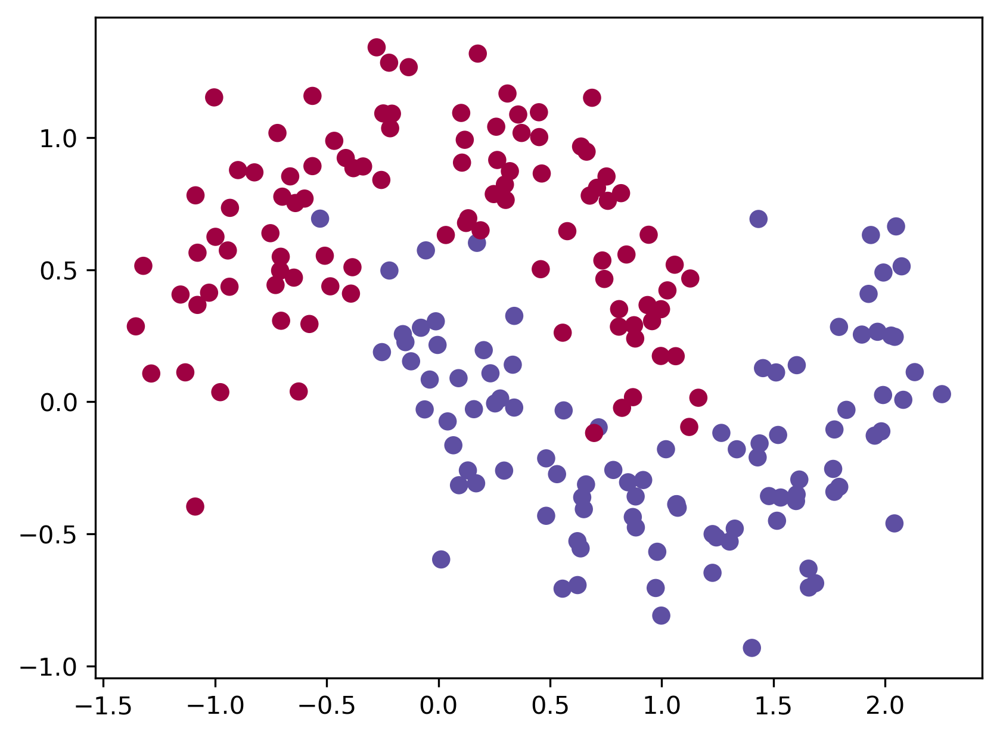

Hongji Wang

hw88@rice.edu

# 1 Backpropagation in a Simple Neural Network

   

## 1.1 Mathematical Derivation

### 1.1.1 Back Propagation

#### Forward Propagation

$$
z_1 = W_1 x + b_1 \\
a_1 = \sigma(z_1) \\
z_2 = W_2 a_1 + b_2  \\
a_2 = \sigma(z_2)  \\
z_3 = W_3 a_2 + b_3  \\
\hat{y}_i = \frac{\exp(z_3^i)}{\sum_j \exp(z_3^j)}  \\
$$

### Backpropagation

1. Output Layer:
   $$
   \delta_3 = \hat{y} - y \\
   \frac{\partial L}{\partial W_3} = \delta_3 a_2^T, \quad \frac{\partial L}{\partial b_3} = \delta_3
   $$
   
2. Second Layer:
   $$
   \delta_2 = (W_3^T \delta_3) \cdot \sigma'(z_2) \\
   \frac{\partial L}{\partial W_2} = \delta_2 a_1^T, \quad \frac{\partial L}{\partial b_2} = \delta_2
   $$
   
   
3. First Layer:
   $$
   \delta_1 = (W_2^T \delta_2) \cdot \sigma'(z_1) \\
   \frac{\partial L}{\partial W_1} = \delta_1 x^T, \quad \frac{\partial L}{\partial b_1} = \delta_1
   $$

### 1.1.2 Experiments and Results

 

[2, 3, 2], Sigmoid, loss= 0.078155

 

[2, 3, 2], Tanh, loss= loss= 0.070758

 

[2, 3, 2], ReLU, loss= 0.071219

Although the losses of the three activation functions are the same, the decision boundaries of *Sigmoid* and *Tanh* are smoother than those of *ReLU*. This could be because the *Sigmoid* and *Tanh* activation functions map inputs to differentiable and bounded values, while the *ReLU* activation function maps inputs to values that have non-differentiable parts and are unbounded.

[2, 3, 2], Tanh, loss= 0.070758

[2, 5, 2], Tanh, loss= 0.039037

[2, 10, 2], Tanh, loss= 0.030565

When the number of hidden units increases, the final loss decreases and the decision boundary becomes more dynamic. This may be because having more units in the hidden layer provides the network with greater learning capabilities.

## 1.2 n_layer_neural_network

### 1.2.1 make_moons

Left: [2, 3, 2], Sigmoid;

Right: [2, 3, 3, 2], Sigmoid;

Left: [2, 3, 2], Tanh;

Right: [2, 3, 3, 2], Tanh;

Left: [2, 3, 2], ReLU;

Right: [2, 3, 3, 2], ReLU;

As shown in the figure, after adding a new layer, the results did not change significantly. However, to achieve better outcomes when training the n_layer_neural_network, it's important to reduce the learning rate and regularization parameters to avoid overfitting, especially with the ReLU activation function. In this experiment, for *Sigmoid* and *Tanh* activation function, the layer configuration [2, 3, 3, 2], the learning_rate (epsilon)was set to 0.005, and the regularization parameter (reg_lambda) to 0.005. For ReLU, both learning_rate and regularization parameter was set to 0.001.

[2, 3, 3, 2], Tanh

[2, 5, 5, 2], Tanh

[2, 10, 10, 2], Tanh

[2, 20, 20, 2], Tanh

When adding hidden units in the 4-layer neural network, the decision boundary also changes. This shows that the newly added neurons are still learning new “knowledge”. However, I think that after increasing the number of hidden units from 10 to 20, although the decision boundary becomes more dynamic, the resulting classification does not change substantially. Maybe the model is close to overfitting at this point.

### 1.2.2 breast_cancer dataset

The breast_cancer dataset has 569 samples, and each sample has 30 features. Therefore, it is hard to visualize the dataset. The target variable is binary, with "1" representing malignant tumors and "0" representing benign ones. 80% of dataset was used for training and 20% of dataset was used for testing. To measure the network’s performance, I choose to show the accuracy in test_dataset. *total_iteration*=20000, *learning_rate*=0.005, *reg_lambda*=0.005

| **Accuracy**         | ***Sigmoid*** | ***Tanh*** | **ReLU** |
| -------------------- | ------------- | ---------- | -------- |
| **layer=[30, 10, ]** | 97.37         | 98.25      | 95.61    |
| **layer=[30, 30, ]** | 98.25         | 98.25      | 96.49    |
| **layer=[30, 50, ]** | 97.37         | 98.25      | 96.49    |

As shown in the table, the results are somewhat “stable”, while *Tanh* is the best activation function. For *Sigmoid*, when layer=[30, 50, ], it seems that overfitting occurs.

# 2 Training a Simple Deep Convolutional Network on MNIST

In the code, I  changed the optimizer from *Adam* to *SGD* and added Xavier initialization and learning rate decay to train a better DCN.

The *test_acc* and test_loss images show the recognition results on the *MNIST* dataset under various hyperparameter settings. The hyperparameter *SGD_lr0.01_reg0.01_Xavier_lrDecay* is considered the most robust. 

Perhaps due to the simplicity of the *MNIST* dataset, certain hyperparameter configurations had minimal impact on the results. The two most influential hyperparameters were the Xavier initialization and the optimizer. Without Xavier initialization, the test accuracy was quite low at the start. When using the Adam optimizer with a learning rate of 0.01, the rate seemed too high, preventing effective learning. However, after reducing the learning rate to 0.005, the test accuracy significantly improved.

The four images show the changes in DCN.

# 3 Questions/Comments

1. "I’m curious about the purpose of *self.conv2_drop*. Based on its name, it seems to be intended for applying *dropout* to the *conv2* layer. However, since no such layer exists in *dcn_mnist.py*, I added a dropout layer between *self.fc1* and *self.fc2* instead.
2. In *three_layer_network.py*, I believe it's not ideal to omit the learning_rate (epsilon) in the *\_\_init\_\_()* function. I modified the code to make epsilon a parameter within *\_\_init\__(\)*, allowing users to adjust the learning rate when creating the model.
3. I'm not sure if having *DeepNeuralNetwork* inherit from *NeuralNetwork* is appropriate, as the structures of *n_layer_neural_network* and *three_layer_network* differ quite significantly."